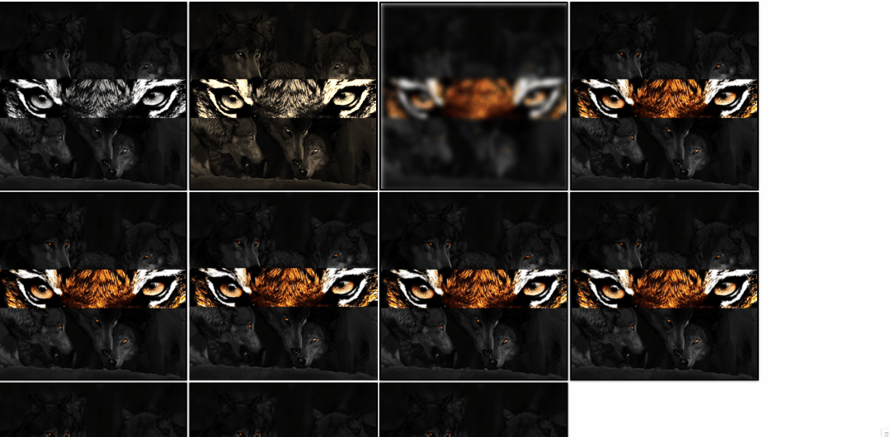
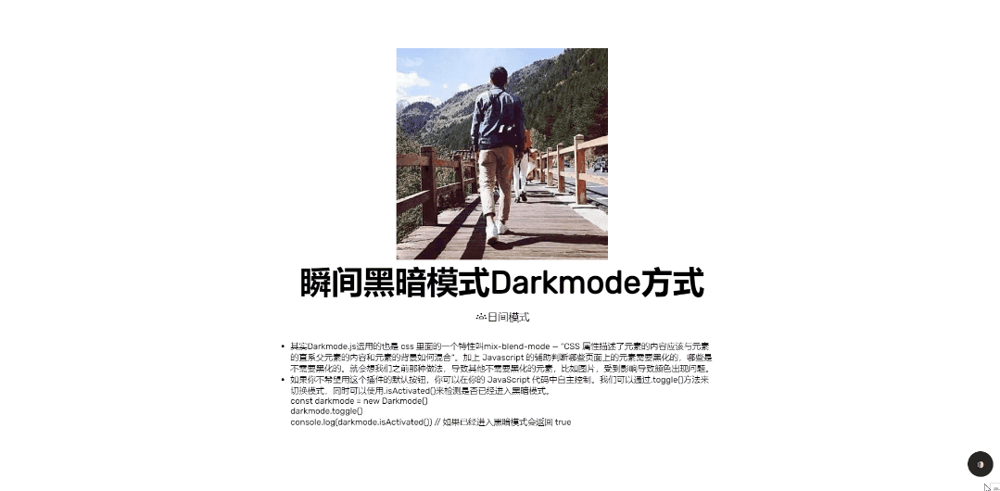
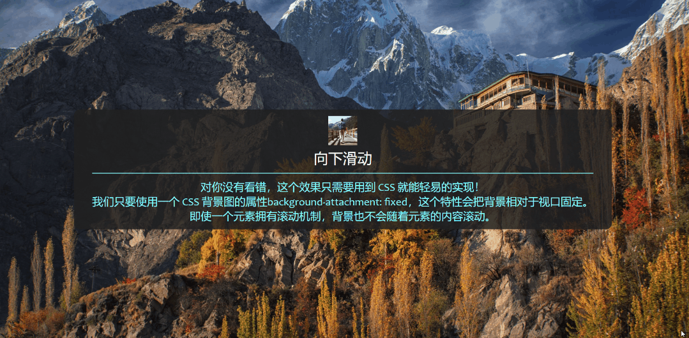

# html-skill

#### 介绍
分享一些新的 CSS 技巧【日常记录】
1. 固定底部内容【flex-grow,flex-shink】
2. 悬停放大和滤镜图片特效
3. 瞬间黑暗模式Invert方式
4. 瞬间黑暗模式Darkmode方式
5. 自定义列表符号
6. 面包屑导航条
7. 图片视差效果
8. 案例-视差效果案例-Ori游戏
9. 视差速度
10. 裁剪图像的动画
11. 混合模式
12. 瀑布流布局

#### 案例-效果图：
**案例-视差效果案例-Ori游戏**

**悬停放大和滤镜图片特效**

**瞬间黑暗模式Darkmode方式**

**图片视差效果**

